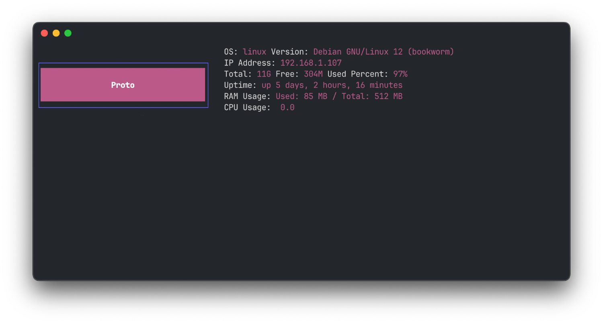

# Lipstick on a Pig 💄🐽



Simple MOTD using golang and [Lipgloss](https://github.com/charmbracelet/lipgloss) by [Charm©](https://charm.sh/)

I use it to get basic information when I log in to my many containers and VMs. Should work on any modern version of Mac, Debian and probably other linux distros. First time programming in go, but at least it Looks pretty!

Pull requests welcome!

## Install

### Script

### Manual

Download the binary and move it to the proper place
```bash
wget https://github.com/Porco-Rosso/Lipstick-on-a-Pig/releases/latest/download/lipgloss-on-a-pig_darwin_amd64
mkdir /usr/local/bin/
mv lipgloss-on-a-pig_darwin_amd64 /usr/local/bin/lipgloss-on-a-pig
```

make executable
```bash
chmod +x /usr/local/bin/lipgloss-on-a-pig
```

remove old MOTD. Warning this will permenantly delete your old MOTD!
```bash
echo -n >/etc/update-motd.d/10-uname
echo -n > /etc/motd
```

Add to .bashrc so it displays at login
```bash
LINE='/usr/local/bin/lipgloss-on-a-pig"'
FILE='~/.bashrc'
grep -qF -- "$LINE" "$FILE" || echo "$LINE" >> "$FILE"
```

test it out
```bash
/usr/local/bin/lipgloss-on-a-pig
```

## Build

`apt install golang -y` or follow the installation instructions on [go.dev](https://go.dev/doc/install)

`git clone zzz`

`cd Lipstick-on-a-Pig`

Make your changes to `lipstick-on-a-pig.go`

`CGO_ENABLED=0 go build`

You should end up with a binary named lipstick-on-a-pig for your OS and arch


